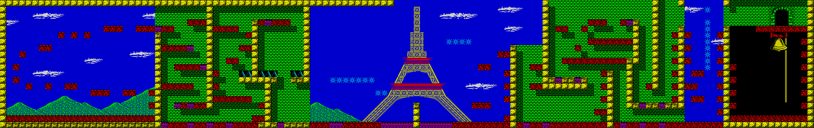
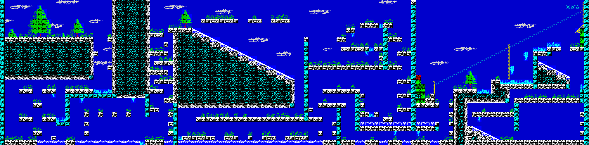
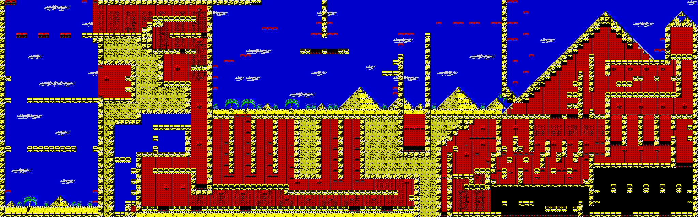
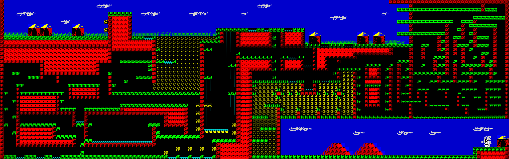

Working on disassembly of [CJ's Elephant Antics](https://spectrumcomputing.co.uk/index.php?cat=96&id=9323) for the ZX Spectrum.

## Maps

Based on the discoveries while disassembling the original code, I've managed to extract the original map data and rebuild the maps as images. The code I wrote to generate the images is [`main.go`](https://github.com/petemoore/cjs_elephant_antics_disassembly/blob/master/main.go) (in the root directory of this repository):

### Level 1 (France)



### Level 2 (Switzerland)



### Level 3 (Egypt)



### Level 4 (Africa)



## Tape files

```
Nellie,10.zx0 (62 bytes)
Nellie2,#6356,25430.zx3 (423 bytes)
headerless-data,255,229.zx4 (6912 bytes)
headerless-data,255,253.zx4 (37119 bytes)
headerless-data,255,241.zx4 (16384 bytes)
```

## Nellie (BASIC)

Listing looks like:

```
  10 CLEAR 99999
  20 LOAD "Nellie2"CODE 99999
  30 RANDOMIZE USR 99999
```

However, the numbers have been altered in the BASIC listing, actual values are:

```
  10 CLEAR 25430                      // 0x6356
  20 LOAD "Nellie2"CODE 25430         // 0x6356
  30 RANDOMIZE USR 25725              // 0x647d
```

## Nellie2 (Code)

```
6356  3E FF              ld a,-1
6358  32 FF FF           ld ($FFFF),a
635B  31 00 60           ld sp,$6000
635E  DD 21 56 64        ld ix,$6456
6362  21 00 40           ld hl,$4000
6365  11 00 1B           ld de,$1B00
6368  0E 00              ld c,0
636A  CD 8F 63           call $638F
636D  DD 21 63 64        ld ix,$6463
6371  21 00 6F           ld hl,$6F00
6374  11 FF 90           ld de,$90FF
6377  0E 00              ld c,0
6379  CD 8F 63           call $638F
637C  DD 21 70 64        ld ix,$6470
6380  21 00 C0           ld hl,$C000
6383  11 00 40           ld de,$4000
6386  0E 04              ld c,4
6388  CD 8F 63           call $638F
638B  AF                 xor a
638C  C3 08 F5           jp $F508

638F  DD 22 32 64        ld ($6432),ix
6393  22 30 64           ld ($6430),hl
6396  ED 53 2E 64        ld ($642E),de
639A  79                 ld a,c
639B  32 34 64           ld ($6434),a
639E  CD F1 63           call $63F1
63A1  CD 00 01           call $0100
63A4  2A 32 64           ld hl,($6432)
63A7  01 01 00           ld bc,1
63AA  11 01 00           ld de,1
63AD  CD 06 01           call $0106
63B0  D2 D0 63           jp nc,$63D0
63B3  2A 30 64           ld hl,($6430)
63B6  3A 34 64           ld a,($6434)
63B9  4F                 ld c,a
63BA  06 00              ld b,0
63BC  ED 5B 2E 64        ld de,($642E)
63C0  CD 12 01           call $0112
63C3  06 00              ld b,0
63C5  CD 09 01           call $0109
63C8  CD 9C 01           call $019C
63CB  CD 13 64           call $6413
63CE  37                 scf
63CF  C9                 ret

63D0  F5                 push af
63D1  06 00              ld b,0
63D3  CD 0C 01           call $010C
63D6  CD 9C 01           call $019C
63D9  CD 13 64           call $6413
63DC  F1                 pop af
63DD  32 FF FF           ld ($FFFF),a
63E0  3E 02              ld a,2
63E2  D3 FE              out ($FE),a
63E4  3E 2A              ld a,42
63E6  CD C1 60           call $60C1
63E9  3A FF FF           ld a,($FFFF)
63EC  CD AA 60           call $60AA
63EF  A7                 and a
63F0  C9                 ret

63F1  F3                 di
63F2  ED 56              im 1
63F4  FD 21 3A 5C        ld iy,$5C3A
63F8  3A 5C 5B           ld a,($5B5C)
63FB  F6 07              or $07
63FD  E6 EF              and $EF
63FF  32 5C 5B           ld ($5B5C),a
6402  01 FD 7F           ld bc,$7FFD
6405  ED 79              out (c),a
6407  3E 04              ld a,4
6409  32 67 5B           ld ($5B67),a
640C  01 FD 1F           ld bc,$1FFD
640F  ED 79              out (c),a
6411  FB                 ei
6412  C9                 ret

6413  F3                 di
6414  3A 5C 5B           ld a,($5B5C)
6417  E6 F8              and $F8
6419  F6 10              or $10
641B  32 5C 5B           ld ($5B5C),a
641E  01 FD 7F           ld bc,$7FFD
6421  ED 79              out (c),a
6423  3E 04              ld a,4
6425  01 FD 1F           ld bc,$1FFD
6428  32 67 5B           ld ($5B67),a
642B  ED 79              out (c),a
642D  C9                 ret
642E  00                 nop
642F  00                 nop
6430  00                 nop
6431  00                 nop
6432  00                 nop
6433  00                 nop
6434  00                 nop
6435  00                 nop
6436  00                 nop
6437  00                 nop
6438  00                 nop
6439  00                 nop
643A  00                 nop
643B  00                 nop
643C  4E                 ld c,(hl)
643D  45                 ld b,l
643E  4C                 ld c,h
643F  4C                 ld c,h
6440  49                 ld c,c
6441  45                 ld b,l
6442  20 20              jr nz,$6464
6444  2E 20              ld l,32
6446  20 20              jr nz,$6468
6448  FF                 rst 38h
6449  4E                 ld c,(hl)
644A  45                 ld b,l
644B  4C                 ld c,h
644C  4C                 ld c,h
644D  49                 ld c,c
644E  45                 ld b,l
644F  32 20 2E           ld ($2E20),a
6452  20 20              jr nz,$6474
6454  20 FF              jr nz,$6455
6456  4E                 ld c,(hl)
6457  45                 ld b,l
6458  4C                 ld c,h
6459  5F                 ld e,a
645A  53                 ld d,e
645B  43                 ld b,e
645C  4E                 ld c,(hl)
645D  20 2E              jr nz,$648D
645F  20 20              jr nz,$6481
6461  20 FF              jr nz,$6462
6463  4E                 ld c,(hl)
6464  45                 ld b,l
6465  4C                 ld c,h
6466  5F                 ld e,a
6467  43                 ld b,e
6468  4F                 ld c,a
6469  44                 ld b,h
646A  20 2E              jr nz,$649A
646C  20 20              jr nz,$648E
646E  20 FF              jr nz,$646F
6470  4E                 ld c,(hl)
6471  45                 ld b,l
6472  4C                 ld c,h
6473  5F                 ld e,a
6474  42                 ld b,d
6475  41                 ld b,c
6476  4E                 ld c,(hl)
6477  20 2E              jr nz,$64A7
6479  20 20              jr nz,$649B
647B  20 FF              jr nz,$647C

// Entry point

647D  3E FF              ld a,-1           // A = 0xff
647F  32 FF FF           ld ($FFFF),a      // [0xffff] = 0xff
6482  31 00 60           ld sp,$6000       // SP = 0x6000
6485  21 00 58           ld hl,$5800       // HL = 0x5800
6488  11 01 58           ld de,$5801       // DE = 0x5801
648B  01 FF 02           ld bc,767         // BC = 0x02ff
648E  36 00              ld (hl),0         // [0x5800] = 0
6490  ED B0              ldir              // [0x5800 -> 5AFF] = 0 => Attributes file set to 0's (black screen)
6492  DD 21 00 40        ld ix,$4000       // display file address
6496  11 00 1B           ld de,$1B00       // length of display file + attributes file
6499  CD E0 64           call $64E0        // load loading screen
649C  DD 21 00 6F        ld ix,$6F00       // start address of next code block
64A0  11 FF 90           ld de,$90FF       // length of next code block
64A3  CD E0 64           call $64E0        // load 0x90ff (37119) bytes at address 0x6f00 (28416) (up to address 0xfffe = 65534)
64A6  F3                 di                // I think not needed - interrupts were disabled at 0x64ea
64A7  21 00 C0           ld hl,$C000       // HL = 49152
64AA  01 FD 7F           ld bc,$7FFD       // BC = Memory paging port
64AD  5E                 ld e,(hl)         // E = [49152]
64AE  36 55              ld (hl),85        // [49152] = 0x55 = 0x01010101  =>  Corrupt first byte of RAM bank 0
64B0  3E 14              ld a,20           // A = 20
64B2  ED 79              out (c),a         // Page in ROM1 / RAM bank 4
64B4  36 AA              ld (hl),-86       // [49152] = 0xAA = 0x10101010  =>  Corrupt first byte of RAM bank 4 on 128k, or RAM bank 0 on 48k
64B6  3E 10              ld a,16           // A = 16
64B8  ED 79              out (c),a         // Page in ROM1 / RAM bank 0
64BA  7E                 ld a,(hl)         // A = [HL]      => check what corrupted value is
64BB  73                 ld (hl),e         // [HL] = E      => restore original value
64BC  E6 AA              and $AA           // AND 0x10101010 to see if 128K or 48K spectrum
64BE  C2 08 F5           jp nz,$F508       // If 48K, jump to start of code at 0xf508

// 128K Spectrum only

64C1  3E 14              ld a,20           // A = 20
64C3  ED 79              out (c),a         // Page in ROM1 / RAM bank 4
64C5  32 5C 5B           ld ($5B5C),a      // Update standard sysvariable [BANK_M] with paged in memory value
64C8  DD 21 00 C0        ld ix,$C000       // IX = start of RAM bank 4
64CC  11 00 40           ld de,$4000       // DE = size of RAM bank 4
64CF  CD E0 64           call $64E0        // load 0x4000 (16384) bytes at address 0xc000 (49152) (all of RAM bank 4)
64D2  01 FD 7F           ld bc,$7FFD       // BC = memory paging port
64D5  3E 10              ld a,16           // A = 16
64D7  ED 79              out (c),a         // Page in ROM1 / RAM bank 0
64D9  32 5C 5B           ld ($5B5C),a      // Update standard sysvariable [BANK_M] with paged in memory value
64DC  AF                 xor a             // A = 0
64DD  C3 08 F5           jp $F508          // Jump to start at 0xf508

// Load DE bytes from tape at address IX

64E0  F3                 di                // Disable interrupts
64E1  3E FF              ld a,-1           // A=0xff indicates data (not header) block to be read
64E3  37                 scf               // Set carry flag indicates data to be loaded (not verified)
64E4  14                 inc d             // Reset zero flag (since DE <= 0x4000) leaving carry untouched
64E5  08                 ex af,af'         // Preserve entry flags and A (other than zero flag now reset)
64E6  15                 dec d             // Reset DE to original value
64E7  CD 62 05           call $0562        // Load data block (without header)
64EA  F3                 di                // Disable interrupts
64EB  38 0B              jr c,$64F8        // If carry set, no errors occurred, jump ahead (see https://www.worldofspectrum.org/ldbytes.html)

// Handle error

64ED  01 FD 7F           ld bc,$7FFD       // Memory paging port
64F0  3E 10              ld a,16           // Set bit 4
64F2  ED 79              out (c),a         // Page in ROM 1 (48K ROM) at 0x0000 and RAM 0 at 0xc000
64F4  AF                 xor a             // A = 0
64F5  32 FF FF           ld ($FFFF),a      // [0xFFFF] = 0

64F8  3E 00              ld a,0            // 0 = colour black
64FA  D3 FE              out ($FE),a       // Set black border
64FC  C9                 ret               // return
```

## Main program

```
F508  F3                 di                // disable interrupts
F509  21 00 6F           ld hl,$6F00
F50C  11 00 5B           ld de,$5B00
F50F  01 00 78           ld bc,$7800
F512  ED B0              ldir              // move memory down [6f00-e6ff] -> [5b00-d2ff]; data region?!?
                                           // freeing up 0x1400 bytes [d300 - e6ff]
F514  32 96 B0           ld ($B096),a
F517  31 60 B0           ld sp,$B060
F51A  CD 30 F5           call $F530
F51D  FB                 ei
F51E  AF                 xor a
F51F  D3 FE              out ($FE),a
F521  CD 93 F5           call $F593
F524  CD 7F F5           call $F57F
F527  CD 5E F5           call $F55E
F52A  CD 44 F5           call $F544
F52D  C3 16 B3           jp $B316

F530  21 00 AF           ld hl,$AF00      // Interrupt vector table
F533  11 01 AF           ld de,$AF01
F536  01 00 01           ld bc,256
F539  36 B0              ld (hl),-80
F53B  ED B0              ldir             // [0xaf00 - 0xb000] = 0xb0 (176) -> set interrupt routine to 0xb0b0 which is 0xc4b0 from original code
F53D  3E AF              ld a,-81
F53F  ED 47              ld i,a
F541  ED 5E              im 2
F543  C9                 ret

F544  F3                 di
F545  01 00 50           ld bc,$5000
  F548  DB 1F              in a,($1F)
  F54A  B1                 or c
  F54B  4F                 ld c,a
  F54C  FB                 ei
  F54D  76                 halt
  F54E  F3                 di
  F54F  10 F7              djnz $F548
F551  79                 ld a,c
F552  E6 E0              and $E0
F554  3E 00              ld a,0
F556  28 01              jr z,$F559
F558  3D                 dec a
F559  32 86 B0           ld ($B086),a
F55C  FB                 ei
F55D  C9                 ret

F55E  21 00 E8           ld hl,$E800
F561  7D                 ld a,l
F562  1F                 rra
F563  CB 11              rl c
F565  1F                 rra
F566  CB 11              rl c
F568  1F                 rra
F569  CB 11              rl c
F56B  1F                 rra
F56C  CB 11              rl c
F56E  1F                 rra
F56F  CB 11              rl c
F571  1F                 rra
F572  CB 11              rl c
F574  1F                 rra
F575  CB 11              rl c
F577  1F                 rra
F578  CB 11              rl c
F57A  71                 ld (hl),c
F57B  2C                 inc l
F57C  20 E3              jr nz,$F561
F57E  C9                 ret

F57F  11 00 E7           ld de,$E700
F582  2E 00              ld l,0
  F584  26 80              ld h,-128
  F586  AF                 xor a
  F587  06 2F              ld b,47
    F589  AE                 xor (hl)
    F58A  24                 inc h
    F58B  10 FC              djnz $F589
  F58D  12                 ld (de),a
  F58E  1C                 inc e
  F58F  2C                 inc l
  F590  20 F2              jr nz,$F584
F592  C9                 ret

F593  21 4B F7           ld hl,$F74B
F596  11 80 50           ld de,$5080
F599  06 20              ld b,32
F59B  C5                 push bc
F59C  D5                 push de
F59D  01 20 00           ld bc,32
F5A0  ED B0              ldir
F5A2  D1                 pop de
F5A3  C1                 pop bc
F5A4  CD B5 F5           call $F5B5
F5A7  10 F2              djnz $F59B
F5A9  21 00 E7           ld hl,$E700
F5AC  11 80 5A           ld de,$5A80
F5AF  01 80 00           ld bc,128
F5B2  ED B0              ldir
F5B4  C9                 ret
```


## Interrupt routine

```
B0B0  22 DF B0           ld ($B0DF),hl
B0B3  21 00 00           ld hl,0
B0B6  E3                 ex (sp),hl
B0B7  22 E8 B0           ld ($B0E8),hl
B0BA  ED 73 E2 B0        ld ($B0E2),sp
B0BE  31 24 B0           ld sp,$B024
B0C1  F5                 push af
B0C2  C5                 push bc
B0C3  D5                 push de
B0C4  CD EA B0           call $B0EA
B0C7  CD 60 B1           call $B160
B0CA  CD 6F B1           call $B16F
B0CD  3A 96 B0           ld a,($B096)
B0D0  A7                 and a
B0D1  20 08              jr nz,$B0DB
B0D3  3E 14              ld a,20
B0D5  CD 19 B2           call $B219
B0D8  CD 00 D5           call $D500
B0DB  D1                 pop de
B0DC  C1                 pop bc
B0DD  F1                 pop af
B0DE  21 FF FF           ld hl,-1
B0E1  31 FF FF           ld sp,$FFFF
B0E4  33                 inc sp
B0E5  33                 inc sp
B0E6  FB                 ei
B0E7  C3 00 00           jp $0000
```


## Render screen in CRT beam order to D300

```
BD53  ED 73 D7 C3        ld ($C3D7),sp    // [0xc3d7] = stack pointer backup
BD57  21 00 D3           ld hl,$D300      // HL = 0xd300
BD5A  11 1F 00           ld de,31         // DE = 0x1f
BD5D  D9                 exx              // swap registers
BD5E  2A 75 B0           ld hl,($B075)    // H' = [0xb076] / L' = [0xb075]
BD61  2E 00              ld l,0           // H' = [0xb076] / L' = 0
BD63  CB 3C              srl h            // H' = [0xb076] / 2; carry set if [0xb076] is odd
BD65  CB 1D              rr l             // L' = 128 if [0xb076] is odd; otherwise 0 => HL' = 128 * [0xb076]
BD67  11 00 EB           ld de,$EB00      // D' = 0xeb / E' = 0
BD6A  19                 add hl,de        // HL' = 0xeb00 + 128 * [0xb078]
BD6B  ED 4B 77 B0        ld bc,($B077)    // B' = [0xb078] / C' = [0xb077]
BD6F  06 00              ld b,0           // B' = 0
BD71  09                 add hl,bc        // HL' = 0xeb00 + [0xb077] + 128 * [0xb076]
BD72  EB                 ex de,hl         // DE' = 0xeb00 + [0xb077] + 128 * [0xb076]; HL' = 0xeb00
BD73  01 80 0A           ld bc,$0A80      // BC' = 0x0a80
BD76  D9                 exx              // swap registers

// call entry point
BD77  D9                 exx              // swap registers
BD78  1A                 ld a,(de)        // A' = [0xeb00 + [0xb077] + 128 * [0xb076]] = screen first map entry value (top left) = M
BD79  1C                 inc e            // DE' = 2nd map entry address
BD7A  2E 02              ld l,2           // L' = 00.00.00.00.00.00.01.00
BD7C  CB 3F              srl a            // A' = 00.M7.M6.M5.M4.M3.M2.M1; carry = M0
BD7E  CB 1D              rr l             // L' = M0.00.00.00.00.00.00.01; carry = 00
BD80  1F                 rra              // A' = 00.00.M7.M6.M5.M4.M3.M2; carry = M1
BD81  CB 1D              rr l             // L' = M1.M0.00.00.00.00.00.00; carry = 01
BD83  1F                 rra              // A' = 01.00.00.M7.M6.M5.M4.M3; carry = M2
BD84  CB 1D              rr l             // L' = M2.M1.M0.00.00.00.00.00; carry = 00
BD86  67                 ld h,a           // HL' = 01.00.00.M7.M6.M5.M4.M3.M2.M1.M0.00.00.00.00.00 = 0x8000 + M * 0x20
BD87  F9                 ld sp,hl         // SP = 0x8000 + M * 0x20
BD88  D9                 exx              // restore registers
BD89  C1                 pop bc           // C = [0x8000 + M*20] / B = [0x8001 + M*0x20]
BD8A  71                 ld (hl),c        // [0xd300] = [0x8000 + M*0x20]
BD8B  2C                 inc l
BD8C  70                 ld (hl),b        // [0xd301] = [0x8001 + M*0x20]
BD8D  19                 add hl,de
BD8E  C1                 pop bc
BD8F  71                 ld (hl),c        // [0xd320] = [0x8002 + M*0x20]
BD90  2C                 inc l
BD91  70                 ld (hl),b        // [0xd321] = [0x8003 + M*0x20]
BD92  19                 add hl,de
BD93  C1                 pop bc
BD94  71                 ld (hl),c        // [0xd340] = [0x8004 + M*0x20]
BD95  2C                 inc l
BD96  70                 ld (hl),b        // [0xd341] = [0x8005 + M*0x20]
BD97  19                 add hl,de
BD98  C1                 pop bc
BD99  71                 ld (hl),c        // [0xd360] = [0x8006 + M*0x20]
BD9A  2C                 inc l
BD9B  70                 ld (hl),b        // [0xd361] = [0x8007 + M*0x20]
BD9C  19                 add hl,de
BD9D  C1                 pop bc
BD9E  71                 ld (hl),c        // [0xd380] = [0x8008 + M*0x20]
BD9F  2C                 inc l
BDA0  70                 ld (hl),b        // [0xd381] = [0x8009 + M*0x20]
BDA1  19                 add hl,de
BDA2  C1                 pop bc
```

The map data is stored at 0xeb00, and there is a heap area at 0xd300-0xe6ff
which is used to store data while the maps are decompressed between levels, but
then is reused when the game is running as a buffer for writing display file
data to in "CRT beam order".

Graphics are stored at 0x8000, 32 bytes per graphic (16x16 pixels). In contrast
to the display file, attribute file updates are rendered on-the-fly, based on a
map at 0xea00 which is overlaid with level specific attribute updates.

There are several system variables around 0xb000, some of the key ones being
CJ's map position in 0xb078 (y) and 0xb079 (x) and the screen top-left map
position in 0xb076 (y) and 0xb077 (x).

I'll write up a more detailed explanation soon, I have lots of notes on paper
that need cleaning up.

```
79A0  21 03 0B           ld hl,$0B03      // H = 11, L = 3 (x=11, y=3 screen coords)
79A3  CD C4 B2           call $B2C4       // convert to display file address, and update sysvars [B060 to B063]
79A6  21 DA 75           ld hl,$75DA
79A9  06 08              ld b,8           // do something 8 times
79AB  C5                   push bc
79AC  06 04                ld b,4           // do something 4 times
79AE  7E                     ld a,(hl)
79AF  C5                     push bc
79B0  CD 4E B2               call $B24E
79B3  C1                     pop bc
79B4  23                     inc hl
79B5  10 F7                  djnz $79AE
79B7  3E 20                ld a,32
79B9  CD 4E B2             call $B24E
79BC  06 03                ld b,3           // do something 3 times
79BE  7E                     ld a,(hl)
79BF  23                     inc hl
79C0  C5                     push bc
79C1  CD 1F B2               call $B21F
79C4  C1                     pop bc
79C5  10 F7                  djnz $79BE
79C7  E5                   push hl
79C8  CD BD B2             call $B2BD
79CB  E1                   pop hl
79CC  C1                   pop bc
79CD  10 DC                djnz $79AB
79CF  C3 6F 74           jp $746F


79D2  ED 53 A4 B0        ld ($B0A4),de    // store map location (eb00 -> ...) in [B0A4]
79D6  22 A2 B0           ld ($B0A2),hl    // store screen output location (d300 -> ...) in [B0A2]
79D9  11 1E 00           ld de,30         // D = 0, E = 30
79DC  19                 add hl,de        // HL = screen output location + 30
79DD  22 A6 B0           ld ($B0A6),hl    // [B0A6] = screen output location + 30
79E0  11 00 01           ld de,256        // D = 1, E = 0 => E needs to be fetched from [[B0A6]]
79E3  ED 53 A8 B0        ld ($B0A8),de    // [B0A8] = 0 / [B0A9] = 1

79E7  CD 21 7A             call $7A21       // Set A (0-31) from upper five bits of [[B0A6]]
79EA  FE 1F                cp 31            // Is it 31?
79EC  28 08                jr z,$79F6       // If so, exit loop
79EE  CD 0B 7A             call $7A0B       // A = [[B0A2] + A] (for A < 30) or 8 bits from [[B0A6]] (for A == 30)
79F1  CD 18 7A             call $7A18       // Write to map, and bump map cursor
79F4  18 F1                jr $79E7         // Repeat loop

79F6  CD 21 7A           call $7A21       // Get A (0-31)
79F9  3D                 dec a
79FA  C8                 ret z            // RETURN if A was 1 !!
79FB  3C                 inc a
79FC  F5                 push af          // Stack A
79FD  CD 21 7A           call $7A21       // Get next A (0-31)
7A00  CD 0B 7A           call $7A0B       // A = [[B0A2] + A] (for A < 30) or 8 bits from [[B0A6]] (for A == 30)
7A03  C1                 pop bc           // Pop old AF into BC
7A04  CD 18 7A             call $7A18       // Write to map
7A07  10 FB                djnz $7A04       // Keep writing to map until B = 0
7A09  18 DC              jr $79E7         // Go back to 79E7

7A0B  FE 1E              cp 30            // Is A 30?
7A0D  28 20              jr z,$7A2F       // If so, jump ahead to 7A2F to grab 8 new bits from [[B0A6]] and return
7A0F  2A A2 B0           ld hl,($B0A2)    // HL = screen output location (d300 -> ...)
7A12  5F                 ld e,a
7A13  16 00              ld d,0
7A15  19                 add hl,de        // HL = screen output location + A
7A16  7E                 ld a,(hl)        // A = [screen output location + A]
7A17  C9                 ret

7A18  2A A4 B0           ld hl,($B0A4)    // HL = current map location
7A1B  77                 ld (hl),a        // update with value A
7A1C  23                 inc hl           // bump map location
7A1D  22 A4 B0           ld ($B0A4),hl    // Store updated value
7A20  C9                 ret

7A21  06 05              ld b,5           // call 7A37 5 times
7A23    CD 37 7A           call $7A37
7A26    10 FB              djnz $7A23
                                          // A is now Ex.Ex.Ex.Ex.Ex.A7.A6.A5
7A28  CB 3F              srl a
7A2A  CB 3F              srl a
7A2C  CB 3F              srl a            // A is now 0.0.0.Ex.Ex.Ex.Ex.Ex and carry is A7
7A2E  C9                 ret

7A2F  06 08              ld b,8           // call 7A37 8 times
7A31  CD 37 7A             call $7A37
7A34  10 FB                djnz $7A31
                                          // A is now Ex.Ex.Ex.Ex.Ex.Ex.Ex.Ex
7A36  C9                 ret


7A37  ED 5B A8 B0        ld de,($B0A8)    // E = [B0A8], D = [B0A9] (counter)
7A3B  15                 dec d            // decrease D
7A3C  20 0A              jr nz,$7A48      // if D is zero, set D to 8 and E to [[B0A6]] and increment [B0A6]
7A3E  2A A6 B0           ld hl,($B0A6)    //
7A41  5E                 ld e,(hl)        //
7A42  23                 inc hl           //
7A43  22 A6 B0           ld ($B0A6),hl    //
7A46  16 08              ld d,8           //
7A48  CB 13              rl e             // E7 into carry, and E shifted left
7A4A  1F                 rra              // A = [B0A8:7].A7.A6.A5.A4.A3.A2.A1
7A4B  ED 53 A8 B0        ld ($B0A8),de    // [B0A8] updated with new DE
7A4F  C9                 ret


7A50  21 00 EB           ld hl,$EB00
7A53  22 A6 B0           ld ($B0A6),hl
7A56  2A A4 B0           ld hl,($B0A4)
7A59  22 A2 B0           ld ($B0A2),hl
7A5C  2A 7F B0           ld hl,($B07F)
7A5F  2E 00              ld l,0
7A61  CB 3C              srl h
7A63  CB 1D              rr l
7A65  22 F2 FF           ld ($FFF2),hl
7A68  CD 14 7B           call $7B14
7A6B  3E 00              ld a,0
7A6D  F5                 push af
7A6E  CD 39 7B           call $7B39
7A71  2A A4 B0           ld hl,($B0A4)
7A74  3A F1 FF           ld a,($FFF1)
7A77  77                 ld (hl),a
7A78  23                 inc hl
7A79  22 A4 B0           ld ($B0A4),hl
7A7C  21 00 72           ld hl,$7200
7A7F  6F                 ld l,a
7A80  36 00              ld (hl),0
7A82  24                 inc h
7A83  36 00              ld (hl),0
7A85  F1                 pop af
7A86  3C                 inc a
7A87  FE 1E              cp 30
7A89  20 E2              jr nz,$7A6D
7A8B  CD D2 7A           call $7AD2
7A8E  CD 94 7B           call $7B94
7A91  ED 4B F2 FF        ld bc,($FFF2)
7A95  C5                 push bc
7A96  2A A6 B0           ld hl,($B0A6)
7A99  CD BB 7A           call $7ABB
7A9C  2A A6 B0           ld hl,($B0A6)
7A9F  23                 inc hl
7AA0  22 A6 B0           ld ($B0A6),hl
7AA3  C1                 pop bc
7AA4  0B                 dec bc
7AA5  78                 ld a,b
7AA6  B1                 or c
7AA7  20 EC              jr nz,$7A95
7AA9  CD DA 7A           call $7ADA
7AAC  3E 1F              ld a,31
7AAE  CD 7C 7B           call $7B7C
7AB1  3E 01              ld a,1
7AB3  CD 7C 7B           call $7B7C
7AB6  AF                 xor a
7AB7  CD 74 7B           call $7B74
7ABA  C9                 ret
7ABB  46                 ld b,(hl)
7ABC  78                 ld a,b
7ABD  32 EE FF           ld ($FFEE),a
7AC0  3A EF FF           ld a,($FFEF)
7AC3  B8                 cp b
7AC4  20 14              jr nz,$7ADA
7AC6  3A F0 FF           ld a,($FFF0)
7AC9  FE 1F              cp 31
7ACB  28 0D              jr z,$7ADA
7ACD  3C                 inc a
7ACE  32 F0 FF           ld ($FFF0),a
7AD1  C9                 ret
7AD2  AF                 xor a
7AD3  32 F0 FF           ld ($FFF0),a
7AD6  32 EF FF           ld ($FFEF),a
7AD9  C9                 ret
7ADA  3A F0 FF           ld a,($FFF0)
7ADD  FE 03              cp 3
7ADF  38 13              jr c,$7AF4
7AE1  3E 1F              ld a,31
7AE3  CD 7C 7B           call $7B7C
7AE6  3A F0 FF           ld a,($FFF0)
7AE9  CD 7C 7B           call $7B7C
7AEC  3A EF FF           ld a,($FFEF)
7AEF  CD 58 7B           call $7B58
7AF2  18 14              jr $7B08
7AF4  3A F0 FF           ld a,($FFF0)
7AF7  A7                 and a
7AF8  28 0E              jr z,$7B08
7AFA  47                 ld b,a
7AFB  C5                 push bc
7AFC  3A EF FF           ld a,($FFEF)
7AFF  CD 58 7B           call $7B58
7B02  C1                 pop bc
7B03  10 F6              djnz $7AFB
7B05  C3 08 7B           jp $7B08
7B08  3A EE FF           ld a,($FFEE)
7B0B  32 EF FF           ld ($FFEF),a
7B0E  3E 01              ld a,1
7B10  32 F0 FF           ld ($FFF0),a
7B13  C9                 ret
7B14  21 00 72           ld hl,$7200
7B17  11 01 72           ld de,$7201
7B1A  01 FF 01           ld bc,511
7B1D  AF                 xor a
7B1E  77                 ld (hl),a
7B1F  ED B0              ldir
7B21  11 00 EB           ld de,$EB00
7B24  ED 4B F2 FF        ld bc,($FFF2)
7B28  1A                 ld a,(de)
7B29  6F                 ld l,a
7B2A  26 72              ld h,114
7B2C  34                 inc (hl)
7B2D  20 03              jr nz,$7B32
7B2F  26 73              ld h,115
7B31  34                 inc (hl)
7B32  13                 inc de
7B33  0B                 dec bc
7B34  78                 ld a,b
7B35  B1                 or c
7B36  20 F0              jr nz,$7B28
7B38  C9                 ret
7B39  2E 00              ld l,0
7B3B  01 00 00           ld bc,0
7B3E  26 72              ld h,114
7B40  5E                 ld e,(hl)
7B41  26 73              ld h,115
7B43  56                 ld d,(hl)
7B44  7A                 ld a,d
7B45  B8                 cp b
7B46  38 0C              jr c,$7B54
7B48  20 04              jr nz,$7B4E
7B4A  7B                 ld a,e
7B4B  B9                 cp c
7B4C  38 06              jr c,$7B54
7B4E  7D                 ld a,l
7B4F  32 F1 FF           ld ($FFF1),a
7B52  42                 ld b,d
7B53  4B                 ld c,e
7B54  2C                 inc l
7B55  20 E7              jr nz,$7B3E
7B57  C9                 ret
```

// This routine takes as input an x cell coordinate in H (0-31) and a y cell coordinate in L (0-24) and updates system variables:
// [B060/1] => display file address for first pixel line of cell
// [B062] => L (y coordinate)
// [B063] => H (x coordinate)
```
B2C4  22 62 B0           ld ($B062),hl    // [B062] Store cell coords in HL in [B062]
B2C7  CD 7E B2           call $B27E       // convert to display file address
B2CA  22 60 B0           ld ($B060),hl    // [B060] now holds display file address for coords in [B062]
B2CD  C9                 ret
```


// This routine converts an x cell coordinate (0-31) in H and y cell coordinate (0-23)
// to an address in the display file in HL
```
B27E  7C                 ld a,h           // A = H7.H6.H5.H4.H3.H2.H1.H0
B27F  65                 ld h,l           // H = L7.L6.L5.L4.L3.L2.L1.L0
B280  6F                 ld l,a           // L = H7.H6.H5.H4.H3.H2.H1.H0
B281  7C                 ld a,h           // A = L7.L6.L5.L4.L3.L2.L1.L0
B282  E6 07              and $07          // A = 00.00.00.00.00.L2.L1.L0
B284  0F                 rrca             // A = L0.00.00.00.00.00.L2.L1
B285  0F                 rrca             // A = L1.L0.00.00.00.00.00.L2
B286  0F                 rrca             // A = L2.L1.L0.00.00.00.00.00
B287  B5                 or l             // A = H7||L2.H6||L1.H5||L0.H4.H3.H2.H1.H0
B288  6F                 ld l,a           // L = H7||L2.H6||L1.H5||L0.H4.H3.H2.H1.H0
B289  7C                 ld a,h           // A = L7.L6.L5.L4.L3.L2.L1.L0
B28A  E6 18              and $18          // A = 00.00.00.L4.L3.00.00.00
B28C  C6 40              add a,64         // A = 00.01.00.L4.L3.00.00.00
B28E  67                 ld h,a           // HL = 00.01.00.L4.L3.00.00.00.H7||L2.H6||L1.H5||L0.H4.H3.H2.H1.H0
B28F  C9                 ret              // HL = display file address: H = x coordinate in chars (0-31), L = y coordinate in chars (0-23)
```

// Returns 16 bit value (2 byte) value stored at [DE+2A] in HL
```
B30A  6F                 ld l,a
B30B  26 00              ld h,0           // HL = A
B30D  29                 add hl,hl        // HL = 2 * A
B30E  19                 add hl,de        // HL = 2 * A + DE
B30F  7E                 ld a,(hl)        // A = [DE + (2 * A)]
B310  23                 inc hl           // HL = 2 * A + DE + 1
B311  66                 ld h,(hl)        // H = [2 * A + DE + 1]
B312  6F                 ld l,a           // HL = [DE+2A] + 256 * [DE+2A+1]
B313  C9                 ret
```


And here, the magic:

```
7647  3A 73 B0           ld a,($B073)
764A  ED 4B 72 B0        ld bc,($B072)
764E  B9                 cp c
764F  CA D8 76           jp z,$76D8
7652  21 22 60           ld hl,$6022
7655  11 00 D3           ld de,$D300
7658  01 00 14           ld bc,$1400
765B  ED B0              ldir
765D  DD 21 22 60        ld ix,$6022
7661  11 32 60           ld de,$6032
7664  ED 53 A4 B0        ld ($B0A4),de
7668  2E 00              ld l,0
766A  ED 5B A4 B0        ld de,($B0A4)
766E  E5                 push hl
766F  D5                 push de
7670  3A 72 B0           ld a,($B072)
7673  BD                 cp l
7674  28 3A              jr z,$76B0
7676  3A 73 B0           ld a,($B073)
7679  BD                 cp l
767A  28 1C              jr z,$7698
767C  DD 4E 08           ld c,(ix+8)
767F  DD 46 09           ld b,(ix+9)
7682  DD 6E 00           ld l,(ix+0)
7685  DD 66 01           ld h,(ix+1)
7688  11 DE 72           ld de,$72DE
768B  19                 add hl,de
768C  ED 5B A4 B0        ld de,($B0A4)
7690  ED B0              ldir
7692  ED 53 A4 B0        ld ($B0A4),de
7696  18 18              jr $76B0
7698  CD D2 7B           call $7BD2
769B  ED 5B A4 B0        ld de,($B0A4)
769F  D5                 push de
76A0  CD 50 7A           call $7A50
76A3  D1                 pop de
76A4  2A A4 B0           ld hl,($B0A4)
76A7  A7                 and a
76A8  ED 52              sbc hl,de
76AA  DD 75 08           ld (ix+8),l
76AD  DD 74 09           ld (ix+9),h
76B0  D1                 pop de
76B1  E1                 pop hl
76B2  DD 73 00           ld (ix+0),e
76B5  DD 72 01           ld (ix+1),d
76B8  DD 23              inc ix
76BA  DD 23              inc ix
76BC  2C                 inc l
76BD  7D                 ld a,l
76BE  FE 04              cp 4
76C0  20 A8              jr nz,$766A
76C2  3A 72 B0           ld a,($B072)
76C5  32 73 B0           ld ($B073),a
76C8  11 00 D3           ld de,$D300
76CB  CD 0A B3           call $B30A
76CE  11 DE 72           ld de,$72DE
76D1  19                 add hl,de
76D2  11 00 EB           ld de,$EB00
76D5  CD D2 79           call $79D2

76D8  3E FF              ld a,-1
76DA  32 74 B0           ld ($B074),a
```
